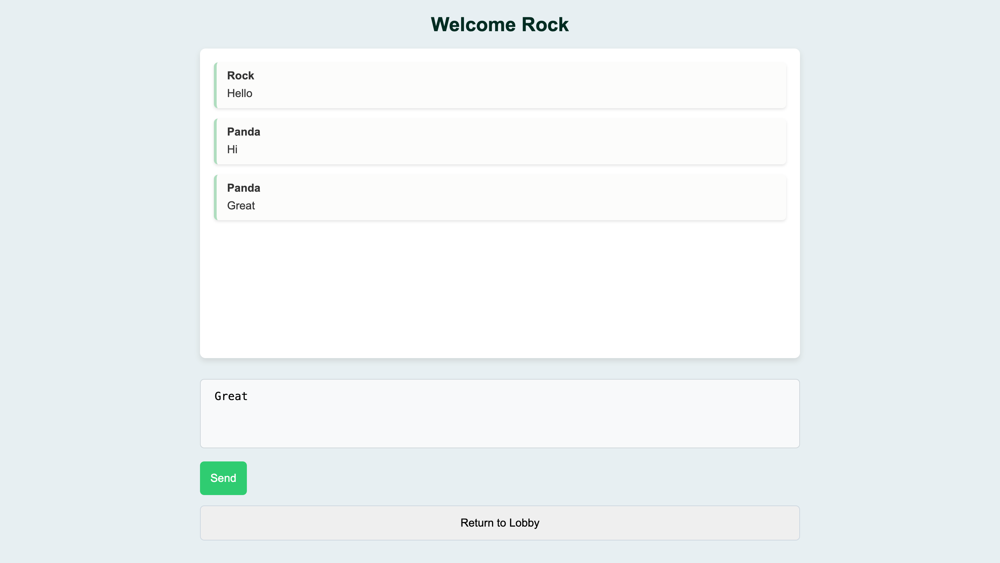

# Converse Chat Application


A simple real-time chat application built with Django, Channels, Daphne, and JavaScript.

## Features

- **User Authentication:** Allows users to join the chat with a chosen username or assigns a random one.
- **Real-time Messaging:** Messages are displayed in real-time using Django Channels and Server-Sent Events (SSE).
- **Responsive Design:** A clean and responsive user interface for a seamless chat experience.
- **Session Management:** Uses Django sessions to manage user sessions and persist usernames.

## Screenshot

<div style="display: flex; justify-content: space-between;">
    
    
</div>

## Getting Started

### Prerequisites

- Python (3.6 or higher)
- Django
- Channels
- Daphne

### Installation

1. Clone the repository:

   ```bash
   git clone https://github.com/ramgovind12/Converse-chat-application.git

2. Navigate to the project Directory:
   ```bash
   cd converseproject

3. Install Dependencies
   
4. Apply Database migrations
   ```bash
   python manage.py migrate

5. Run Server
   ```bash
   python manage.py runserver

